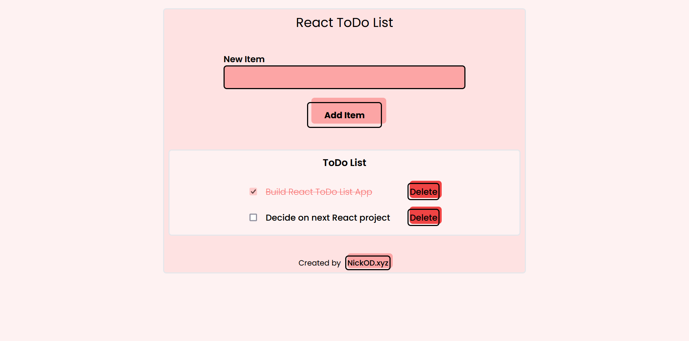

<h1 align="center">React ToDo List | NickOD.xyz</h1>

 

## Overview

This is a React ToDo List app. Unlike my other ToDo list app, I'm not following any tutorial this time. Just figuring it out from my notes and documentation.

 

## Link to Live Site of Notes

[Coming Soon]()

 

## Sticking Points & What I learned

React Components & Passing Props

- Having done this project using seperate components for everything, I gained a far better understanding of passing props from parent to child components. And feel I have a good understanding of the logic behind doing this now.

UseState

- This is still new and very interesting to me. So I'm still getting used to writing the logic for state setters. But feeling like the more I do it the quicker it is coming to me.

## Author

- Website - [NickOD.xyz](http://www.NickOD.xyz)
- My LinkedIn - [LinkedIn](https://www.linkedin.com/in/nick-odonoghue/)

 

## Useful Resources

[React Docs](https://react.dev/learn)

 

## Acknowledgments

[Le Wagon](https://www.lewagon.com/) & all the teachers, TAs and classmates from <em>1122</em>
